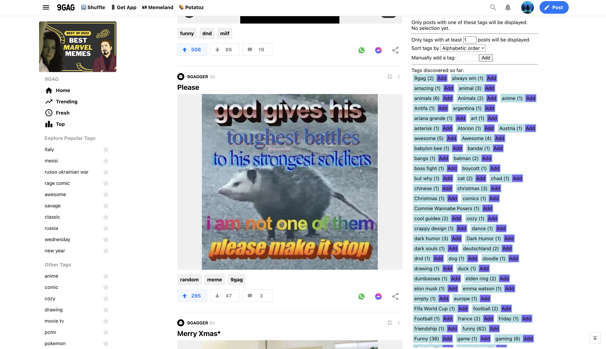

# 9GAG Likes Filter

A tool which allows to filter the 9GAG upvotes / likes personal page only on the tags you are interested in (e.g. funny, gaming, pcmr, etc...).

It uses [TamperMoney](https://www.tampermonkey.net/) to work, either add the script in the dashboard (copy / paste will work) or use the [script on GreasyFork](https://greasyfork.org/en/scripts/457269-9gag-likes-upvotes-page-tag-filter-tool) ([here the install link](https://greasyfork.org/scripts/457269-9gag-likes-upvotes-page-tag-filter-tool/code/9GAG%20Likes%20%20Upvotes%20Page%20Tag%20Filter%20Tool.user.js)).

Here how it works:
 - The script will only activate when you are on your personal upvotes page (under the _9gag.com/u/<user>/likes_ path)
 - Once activated, it will show a new menu on the right side (right on top of the ads, if you don't an ad blocker - which I recommend regardless)
 - As you scroll, all the tags seen in the main view will be collected and added in the right menu
 - As tags are collected, you can click on one (or you can manually enter your own) and only posts belonging to that tag will show
 - To ease exploration, you can sort the tags (alphabetically or frequency) or hide the less frequent ones
 - If you are searching for a tag in particular (e.g. "random" or "pcmr") you can just enter it and wait for the timeline to reach the posts with it
 
_Why aren't all the tags shown in the beginning?_ Tags are fetched from the page itself as the posts are loaded, the script just hides the non-matching posts triggering a new fetch to 9GAG servers.
 
**Warning**: the script is very naive, it just hides posts that don't have the selected tag. If you select a very infrequent tag, 9gag servers will be bombed until posts with the given tag will appear (potentially never, fetching your whole timeline for nothing).

|  |
| --- |
| _Screenshot of the script in action_ |
